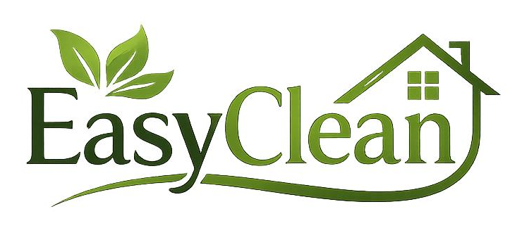

# Easy Clean Luxembourg

Site e app para uma lavandaria ao domicilio em Luxembourg, com landing page, area do cliente, pedidos, tracking, admin, assinaturas e deploy em Cloudflare Workers.



## Site ao vivo

[easyclean.cerqueirapedro275.workers.dev](https://easyclean.cerqueirapedro275.workers.dev)

## Funcionalidades

- Landing page moderna com tema premium verde e dark.
- Seletor de idioma: PT, EN, FR, DE e ES.
- Serviços com paginas individuais explicando cuidado por tecido.
- Formulario de contacto e chamada para WhatsApp.
- Area do cliente com pedidos, historico, tracking, perfil e subscricao.
- Painel admin com dashboard e lista de pedidos.
- Banco D1 com schema Drizzle.
- Deploy em Cloudflare Workers com OpenNext.

## Stack

- Next.js 15
- TypeScript
- Tailwind CSS v4
- Cloudflare Workers
- Cloudflare D1
- Drizzle ORM
- Better Auth
- Stripe
- Resend

## Rodar localmente

```bash
npm install
npm run dev
```

Acesse:

```text
http://localhost:3000
```

## Deploy Cloudflare

```bash
npm run cf:build
npm run cf:deploy
```

O projeto usa `wrangler.toml` com D1 e assets do OpenNext.

## Banco de dados

Gerar migrations:

```bash
npm run db:generate
```

Aplicar no D1 remoto:

```bash
npx wrangler d1 migrations apply easyclean-db --remote
```

## Observacao

As credenciais reais ficam fora do Git. Use `.env.example` como base para configurar o ambiente local.
